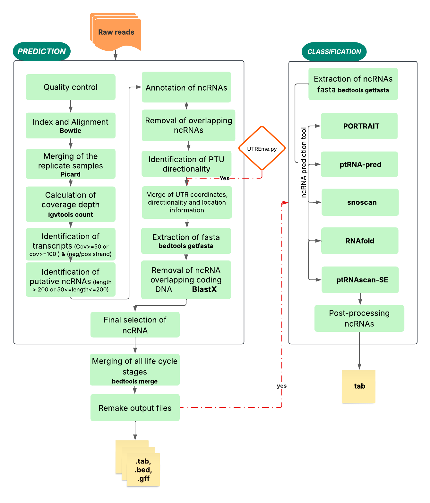

# Tryp-ncRNA

Tryp-ncRNA is a pipeline in order to identify putative non-coding RNAs in Trypanosomatids organisms by analyzing transcripts derived from RNA-seq data. This tool initiates its process by detecting the set of transcripts mapped from sequencing the total RNA of the three life stages of Leishmania braziliensis: procyclic promastigote (PRO), metacyclic promastigote (META), and amastigote (AMA).



 Workflow-Tryp-ncRNA.png

## Introduction
* 2_identify_transcript.py: Identify in all chromossomal positions the coverage >= 50x or 100x reads for strand + & - strand.
* 3_identify_possible_ncRNA_lncRNA.py: Identify lnc-RNA (>200pb) with >= 50x cov and snc-RNA (<200 pb) with >= 100x cov.
* 4_annotation_ncRNA_lncRNA.py: Identify the location of non-coding RNA in coding or intergenic regions. 
* 5_identify_overlap_nc-lncRNA.py: Identify the snc-RNA overlapping lnc-RNA.
* 6_identify_ptu_ssr.py: To identify: PTU and SSR regions.
* 7_parser_UTR_PTU_SSR.py: Add information of sense of non-coding RNA in relation from PTUs and overlapping of ncRNA in UTR and SSR regions.
* 8_select_ncrna.py: Final selection by directory.
* 9_remake_output.py: Create gff, tab and bed format output files.
* 10_postprocessing_ncrna.py: complement with characterization of non-coding RNA


The pipeline process all the python code by directory, each directory can represent a life cycle, that contain the biological repetions in fastq format (*1/2.fastq.gz) and a size of aproximately 72 Mpb (~5 Gb) dependent on therholds 50x and 100x.
 Posteriolly this are merge for a prediction total of ncRNAs.

## Input files
Tryp-ncRNA users should have the following minimal input files:
- lisdir.txt (-dir_list) : File contain a list of
 directories path that contain all fastq files.
- genome.fasta (-fasta): Reference genome FASTA file.
- genome.gff (-gff): Annotation GFF file.

Optional input files using UTRme tool:
- UTRme_fiveutr.tsv (-utr5) : Annotation file for 5' UTRs.
- UTRme_threeutr.tsv (-utr3): Annotation file for 3' UTRs.

## Installation and requirements
The following software and libraries must be installed on your machine:
* Fastqc
* Bowtie2 
* Samtools
* Picard
* Bedtools
* Diamond
* Python3
* Pfam Database
* portrait-1.1 (optional)
* ptRNApred1.0 (optional)
* tRNAscan-SE (optional)
* snoscan (optional)
* RNAcon (optional)
* R
* Java 11+
* Dependences (regex xlsxwriter matplotlib seaborn scipy pysam fuzzywuzzy biopython cutadapt)

## How to install Tryp-ncRNA?

### You can use the git command:
```
sudo apt-get install git
````
```
git clone https://github.com/AKCLAB/Tryp-ncRNA.git
cd Tryp-ncRNA
```

### Then, if you do not have conda/miniconda installed, you must first install it. 
```
wget https://repo.continuum.io/miniconda/Miniconda3-latest-Linux-x86_64.sh
bash Miniconda3-latest-Linux-x86_64.sh
```
Once conda/miniconda is installed, you must create an enviroment and install Tryp-ncRNA. The file tryp-ncrna.yml is inside the Tryp-ncRNA folder.
```
conda env create -f tryp-ncrna.yml
source activate tryp-ncrna
```
### Installation of optional tools

tRNAscan-SE
```
git clone https://github.com/UCSC-LoweLab/tRNAscan-SE.git
cd tRNAscan-SE
./configure
make install
apt install -y infernal
sudo ln -s /usr/bin/cmsearch /usr/local/bin/cmsearch
sudo ln -s /usr/bin/cmscan /usr/local/bin/cmscan
```

PORTRAIT
```
wget https://www.bioinformatics.org/portrait/download/portrait.tar.gz
tar -zxvf portrait.tar.gz
wget https://www.bioinformatics.org/portrait/download/angle.tar.gz
tar -zxvf angle.tar.gz
wget https://www.bioinformatics.org/portrait/download/cast-linux.tar.gz
tar -zxvf cast-linux.tar.gz
chmod +x cast-linux
wget https://www.bioinformatics.org/portrait/download/libsvm-2.84.tar.gz
dpkg --add-architecture i386 && \
apt update && \
apt install -y libc6:i386 libstdc++6:i386 && \
apt install -y libstdc++5 && \
tar -zxvf libsvm-2.84.tar.gz  && \
rm *.gz && \
cd libsvm-2.84  && \
make 
```

ptRNApred
```
wget http://www.ptrnapred.org/ptRNApred1.0.zip
unzip ptRNApred1.0.zip
wget https://www.tbi.univie.ac.at/RNA/download/sourcecode/2_7_x/ViennaRNA-2.7.0.tar.gz
tar -zxvf ViennaRNA-2.7.0.tar.gz
cd ViennaRNA-2.4.17 
./configure --without-perl --without-python --without-python2 --without-forester --without-rnalocmin \
make && make install
```

RNAcon
```
wget http://webs.iiitd.edu.in/raghava/rnacon/RNAcon_v1.0.tar.gz
tar -zxvf RNAcon_v1.0.tar.gz
wget https://osmot.cs.cornell.edu/svm_light/current/svm_light_linux64.tar.gz
tar -zxvf svm_light_linux64.tar.gz\
mv svm_classify RNAcon_standalone/progs
wget https://prdownloads.sourceforge.net/weka/weka-3-8-6-azul-zulu-linux.zip
unzip weka-3-8-6-azul-zulu-linux.zip
chmod +x weka-3-8-6/weka.jar
mv weka-3-8-6/weka.jar RNAcon_standalone/progs
wget https://github.com/satoken/ipknot/releases/download/v1.1.0/ipknot-1.1.0-x86_64-linux.zip
unzip ipknot-1.1.0-x86_64-linux.zip
mv ipknot-1.1.0-x86_64-linux/ipknot RNAcon_standalone/progs
wget https://varna.lisn.upsaclay.fr/bin/VARNAv3-8-src.jar
chmod +x VARNAv3-8-src.jar
mv VARNAv3-8-src.jar RNAcon_standalone/progs

Rscript -e "install.packages('igraph', repos='https://cloud.r-project.org')"
Rscript -e "install.packages('cpp11', repos='https://cloud.r-project.org')"
Rscript -e "if (!requireNamespace('BiocManager', quietly=TRUE)) install.packages('BiocManager', repos='https://cloud.r-project.org')"
Rscript -e "BiocManager::install('Biostrings')"
```

UTRme
```
git clone https://github.com/sradiouy/UTRme.git
cd UTRme
conda env create -f utrme.yml
source activate UTRme
python3 utrme.py Example_configuration_file.txt
```


## Invoking TriTry-ncRNA
```
 bash pipe_ncrna.sh -dir_list <file> -output <path> -db <path> -threads <number> -reffasta <file> -refgff <file> -utr5 <file> -utr3 <file> -dir_tool <path>
```

## Test with example:
```
cd scripts/

bash pipe_ncrna.sh -dir_list /path/to/TriTry-ncRNA/test/listdir.txt -output /path/to/TriTry-ncRNA/test -db /path/to/TriTry-ncRNA/db -threads 20 -reffasta /path/to/TriTry-ncRNA/test/TriTrypDB-30_LbraziliensisMHOMBR75M2903_Genome.fasta -refgff /path/to/TriTry-ncRNA/test/TriTrypDB-30_LbraziliensisMHOMBR75M2903.gff -utr5 /path/to/TriTry-ncRNA/test/UTRme_fiveutr.tsv -utr3 /path/to/TriTry-ncRNA/TriTry-ncRNA/test/UTRme_threeutr.tsv -dir_tool /path/to/program

```

## Output Files Description

| File Extension | Description |
|---------------|-------------|
| **.gff**  | Annotation GFF Format file containing annotations, identified ncRNA regions. |
| **.bed**  | Browser Extensible Data file used for genomic intervals and features of ncRNA regions. |
| **.tab**  | Tab-delimited file containing the prediction of ncRNA regions in each life stages by exression level, in addition contain the final characterization. |
| **.fasta** | FASTA format file containing nucleotide sequences of identified ncRNAs. |

## Command line options


